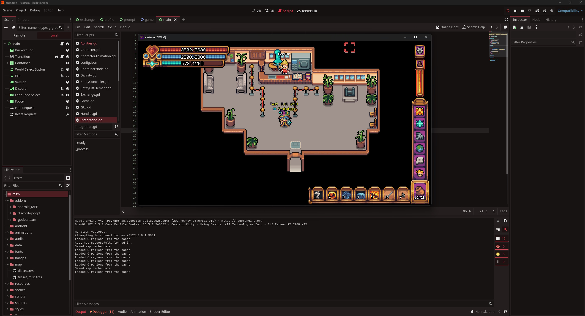

# Aegis Engine LTS

<p align="center">
  <a href="https://aegisengine.org/">
    
  </a>
</p>

[](https://deepwiki.com/Aegis-Engine/aegis-engine)

## 2D and 3D cross-platform game engine

**[Aegis Engine LTS](https://aegisengine.org) is a feature-packed, cross-platform
game engine to create 2D and 3D games from a unified interface.** It provides a
comprehensive set of common tools, so that
users can focus on making games without having to reinvent the wheel. Games can
be exported with one click to a number of platforms, including the major desktop
platforms (Linux, macOS, Windows), mobile platforms (Android, iOS), as well as
Web-based platforms and consoles.

## Free, open source and community-driven

Aegis is a completely free and open source fork of Godot under the very permissive MIT license.
No strings attached, no royalties, nothing. The users' games are theirs, down
to the last line of engine code. Aegis's development is fully independent and truly
community-driven, empowering users to help shape their engine to match their
expectations.

Before being open sourced in [February 2014](https://github.com/godotengine/godot/commit/0b806ee0fc9097fa7bda7ac0109191c9c5e0a1ac),
Godot had been developed by [Juan Linietsky](https://github.com/reduz) and
[Ariel Manzur](https://github.com/punto-) (both still maintaining Godot)
for several years as an in-house engine, used to publish several work-for-hire
titles.

Aegis was forked from Godot in [September 2024](https://github.com/Aegis-Engine/aegis-engine/commit/a12e9de5dd831e1ce0c839f0420b278ef0a6aa5b),
intending to improve upon Godot in order to fulfill its potential and contribute to the shared
codebase of both through a more genuinely community-driven model than Godot.

[Kaetram - 2D Pixel Cross-Platform MMORPG by Keros](https://kaetram.com)
<p align="center">
	
</p>

## Getting the engine

### Binary downloads

Official binaries for the Aegis editor and the export templates can be found
[on the Aegis website](https://aegisengine.org/download) and on the [GitHub page](https://github.com/Aegis-Engine/aegis-engine).

### Compiling from source

[See the official docs](https://docs.aegisengine.org/contributing/development/compiling/)
for compilation instructions for every supported platform.

#### Using Nix (recommended)

If you have the Nix package manager installed, you can build and run the editor in one command:

```bash
nix run .
```

This will automatically install all build dependencies and compile Aegis if the binary doesn't exist.

Detailed Nix usage, including passing SCons build flags through `nix run`, forwarding runtime arguments, and manual `nix develop` workflows, is documented in the `Nix usage guide` at `doc/nix.md`.


## Community and contributing

Aegis is not only an engine but an ever-growing community of users and engine
developers. Please visit our [Discord server](https://discord.gg/aegis)!

To get started contributing to the project, see the [contributing guide](CONTRIBUTING.md).
This document also includes guidelines for reporting bugs.

Follow [Aegis on X/Twitter](https://x.com/Aegis_Engine)!
## Documentation and demos

The class reference is accessible from the Aegis editor.

## AI Integration - Model Context Protocol (MCP)

Aegis supports AI integration using MCP. See the [setup instructions](doc/mcp-integration.md).
